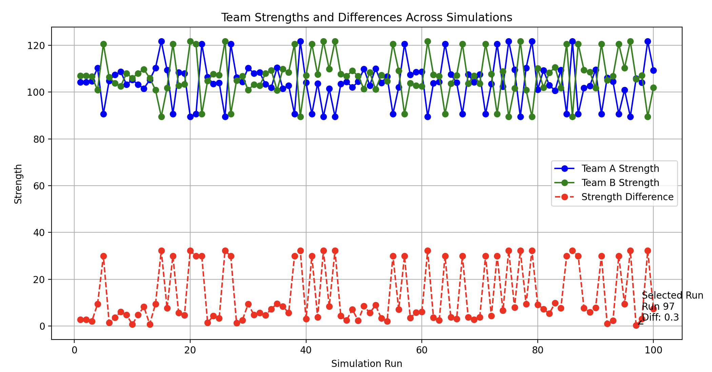

# astroball

Astroball 7 and 8 a side soccer team generator

Setup Instructions for New Users
Clone the Repository:

```bash
Copy code
git clone https://github.com/yourusername/team-balancer.git
cd team-balancer
Install Dependencies: Ensure you have Poetry installed. Then:
```

```bash
Copy code
poetry install
Run the Script: Provide the weekly player names and run the script:
```

```bash
Copy code
poetry run python team_balancer.py
Check Outputs:
```

Updated data/teams.csv with weekly team assignments.
Updated data/player_stats.csv if new players were added or stats were learned.

## Output plot



## Input data

Create a csv called `player_stats.csv`

```csv
Player,Role,Overall,Defense,Attack,Stamina,Versatility,Experience,Speed,Passing,Positioning,Aggression,Wins,Losses,Goals,Assists,Tactical notes,MVP
Player1,Forward,8,6,8,7,5,,,,,,,,,,,
Player2,Midfielder,7,5,6,8,6,,,,,,,,,,,
,Midfielder,9,6,9,6,8,,,,,,,,,,,
```

How to Use This CSV
Important Attributes (Populated):
Defense, Attack, Stamina, Versatility, Wins, MVP, Attendance, Preferred Role.
Less Important Attributes (Set to null):
Speed, Passing, Positioning, Aggression, Goals, Assists, Experience, Tactical Notes.


## Example to run

`poetry run python team_balancer.py Player1 Player2 Player3`


## Run demo

Use `--demo` flag to run with some dummy data

## Output

Will show 3 output teams.


Balanced Team 1:
Team A:
       Player        Role  Overall  Defense  Attack  Strength
0     Player1     Forward        9      NaN     NaN       NaN
2     Player2    Defender        6      6.0     5.0     11.40
4     Player3     Forward        8      NaN     NaN       NaN
6     Player4     Forward        7      NaN     NaN       NaN
8     Player5  Midfielder        9      8.0     7.0     15.35
10    Player6  Midfielder        8      NaN     NaN       NaN
12    Player7  Midfielder        9      6.0     9.0     15.35
14    Player8    Defender        6      7.0     4.0     11.15
Total Strength: 53.2

Team B:
       Player        Role  Overall  Defense  Attack  Strength
1      Player9    Defender        7      7.0     6.0     12.55
3      Player10   Defender        7      NaN     NaN       NaN
5      Player11     Forward        8      6.0     8.0     14.20
7      Player12  Midfielder        6      NaN     NaN       NaN
9      Player13  Midfielder        9      NaN     NaN       NaN
11     Player14     Forward        8      6.0     8.0     13.70
13     Player15   Defender        5      NaN     NaN       NaN
15     Player16  Midfielder        7      5.0     6.0     12.55
Total Strength: 53.0
Strength Difference: 0.2


## Historical results

Can record these like this

Team1_Strength,Team2_Strength,Team1_Defense,Team2_Attack,Outcome
56.2,52.4,18,19,1
49.8,51.7,15,20,0
54.3,54.1,17,16,1

